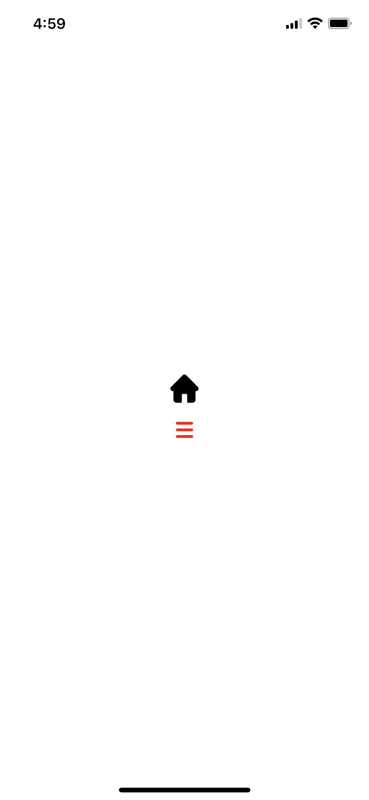

## ※ ReactNative에서 SVG 파일을 아이콘으로 사용할 수 있도록 설정 및 구현된 컴포넌트 프로젝트

 

### 📓 라이브러리 설치 및 설정과 소스코드에 대한 설명은 [`Notion`](https://www.notion.so/2-SVG-7b992c4f18694d99b3216bfab8a60526?pvs=4)참조!

 

**[예시 이미지]**  
</img>
